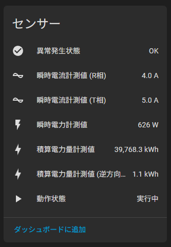

# Wi-SUN2MQTT

[](LICENSE)


## 概要

ECHONET Liteプロトコルを使用して、Wi-SUN対応スマートメーターから取得したデータを解析し、Home AssistantのMQTT Discovery形式で公開するアプリケーションです。

このアプリケーションにより、スマートメーターの情報をHome Assistantに自動登録し、エネルギー使用量のモニタリングや管理を簡単に行えます。

## エンティティ一覧



## サポートデバイス

- ROHM BP35C2(動作確認済み)
- ROHM BP35C2
- ROHM BP35A1
- JORJIN WSR35A1-00
- ラトックシステム RS-WSUHA-P

## 使い方

### Production

```sh
npm install
npm run build
node dist/index
```

### Development

```sh
npm install
npm run dev
```

### Docker

```sh
docker run -d \
  --name wisun2mqtt \
  --device /dev/ttyUSB0:/dev/ttyUSB0 \
  -v /dev/ttyUSB0:/dev/ttyUSB0 \
  -v $(pwd)/.paninfo.json:/app/.paninfo.json \
  -p 3000:3000 \
  --env-file .env \
  --restart always \
  nana4rider/wisun2mqtt:latest
```
